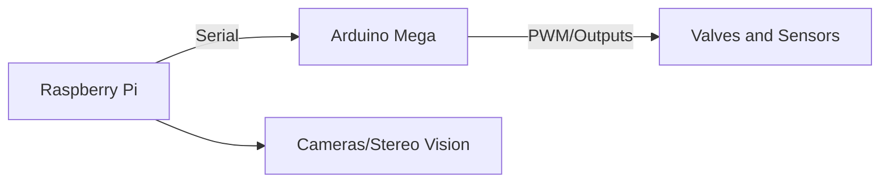

## 🧠 **Project Summary**

**Goal:** Build a robot inspired by Boston Dynamics' bio-robotics, with 4 legs, 2 arms, and visual sensors, for automated space exploration, anchoring on asteroids, remote construction of bases and ships, powered by solar energy.

---

## 🚧 Stage 1: **Development of the Terrestrial Robot (Prototype)**

### 📦 Base Structure

* **Type of robot:** Quadruped with two arms (similar to Boston Dynamics' *Spot*, but with arms and a head with "eyes").
* **Mobility:** 4 legs driven by **pneumatic actuators** — this requires solenoid valves controlled by an **Arduino Mega**, using compressors and tubing.
* **Arms:** Used for manipulation and assembly. Also use compressed air or servo motors.
* **Head:** Two "eyes" (cameras), for stereoscopic vision.

### 🧠 Control and Computing

* **Arduino Mega:** Directly controls motors and sensors (real-time), reads pressure, angle, and position sensors.
* **Raspberry Pi:** Acts as the robot's brain — image processing, navigation, network communication, execution of AI and decision algorithms.
* Communication between them: via **serial port** (UART or USB).



---

## 🧪 Stage 2: **Purchase and Modification of a Commercial Robot**

> “I will buy the robot dog from Boston Dynamics, it costs 400 euros”

Note: a real *Spot Mini* from Boston Dynamics costs much more (around €75,000). This may refer to a **Chinese replica**, which mimics quadruped movement controlled via app or Arduino. These are good bases for adding arms and vision.

* Add:

  * **Arms with servo motors or pneumatic pistons**
  * **Top platform** for Raspberry Pi + batteries + sensors
  * **Vision**: 2 USB cameras or PiCam

---

## 🚀 Stage 3: **Simulated / Future Space Mission**

### 🌌 Robot in Space

* A robot with legs allows **anchoring on asteroids** with near-zero gravity.
* Legs can push, grab, and fix the robot to rocks (better than wheels, which would float).
* Arms build the **robotic base** and the **factory-ship**.

### 🔧 Mission Steps:

1. **Robot is launched into space** with other components.
2. **Controlled remotely from Earth**, begins to assemble the base.
3. **Uses secondary robots** (smaller) to assist — robots building robots.
4. Once the base is ready, robots will:

   * **Capture small asteroids** with nets, arms, or propulsion.
   * **Extract water, metals, and minerals** using tools and thermal cameras.

---

## 🔋 Energy and Climate

### ☀️ Solar Power

* Solar panels recharge the robot’s (Li-Ion) batteries.
* The Raspberry Pi can monitor energy and adjust tasks.
* The Arduino can manage actuator energy consumption.

### 🌑 Cooling via Shade

* In space, there is extreme heat and total cold.
* Use **natural shadow zones** (or create shadows with robotic awnings) to **cool components**.
* Radiators and reflectors may be used to dissipate heat.

---

## 💻 Programming and Updates

> “Everything can be reprogrammed remotely”

* **SSH over radio or satellite network** to access the Raspberry Pi remotely.
* Python or C++ code updates can be sent to change behavior.
* **Arduino Mega** can receive updates via serial interface programmed by the Pi.

---

## 🧩 Modules to Develop

1. **Automatic locomotion**: walking calculation based on sensors and pressure.
2. **Balance**: using IMU sensors and foot feedback.
3. **Stereoscopic vision**: object distance for navigation and manipulation.
4. **Remote task planning**: Python scripts in stages to build structures.
5. **Energy management**: monitor batteries and switch between panels and load.
6. **Transmission and reception**: communication with Earth.

---

## 📅 Timeline

| Month            | Task                                                    |
| ---------------- | ------------------------------------------------------- |
| July–September   | Construction of the terrestrial prototype               |
| October–December | Integration of remote control and vision                |
| January          | Friend on vacation helps with assembling the real robot |
| February–June    | Tests, mission simulation, planning space deployment    |

---

## 🛠️ Suggested Components

* Arduino Mega 2560
* Raspberry Pi 5
* 12V solenoid valves
* Relay or MOSFET modules
* USB cameras or PiCam
* IMU sensors (MPU6050)
* 12V Li-Po battery
* Small solar panels for testing
* Arms with pneumatic pistons or servo motors

---

**To do:**

* Electronic schematics
* Code for walking with pneumatic legs
* Graphical interface for remote control
* 3D simulator of the robot ship in space

---

## 🔧 Architecture

```
[PC with Qt GUI] ─── SSH ───> [Raspberry Pi]
                                   │
               ┌───────────────────┴──────────────────┐
               │                                      │
         [Arduino A via USB]                  [Arduino B via USB]
```

---

## 1. Python Script with Qt GUI (Client PC)

### Requirements:

```bash
pip install PyQt5 paramiko
```

### Code `client_gui.py`

```python
import sys
import paramiko
from PyQt5.QtWidgets import QApplication, QWidget, QVBoxLayout, QPushButton, QLabel, QComboBox, QMenuBar, QFileDialog, QMessageBox

class MainWindow(QWidget):
    def __init__(self):
        super().__init__()
        self.setWindowTitle("Remote Arduino Control")
        self.resize(400, 300)
        
        self.user = "pi"
        self.host = "192.168.1.100"  # Raspberry Pi IP
        self.port = 22
        self.password = "raspberry"
        
        self.init_ui()
    
    def init_ui(self):
        layout = QVBoxLayout()

        menu_bar = QMenuBar(self)
        file_menu = menu_bar.addMenu("File")
        file_menu.addAction("Exit", self.close)
        layout.setMenuBar(menu_bar)

        self.combo_arduino = QComboBox()
        self.combo_arduino.addItems(["Arduino A", "Arduino B"])
        layout.addWidget(self.combo_arduino)

        self.status_label = QLabel("Off")
        layout.addWidget(self.status_label)

        btn_on = QPushButton("Turn On")
        btn_on.clicked.connect(self.turn_on_arduino)
        layout.addWidget(btn_on)

        btn_off = QPushButton("Turn Off")
        btn_off.clicked.connect(self.turn_off_arduino)
        layout.addWidget(btn_off)

        self.setLayout(layout)

    def run_remote_command(self, command):
        try:
            client = paramiko.SSHClient()
            client.set_missing_host_key_policy(paramiko.AutoAddPolicy())
            client.connect(hostname=self.host, username=self.user, password=self.password, port=self.port)

            stdin, stdout, stderr = client.exec_command(command)
            output = stdout.read().decode().strip()
            client.close()
            return output
        except Exception as e:
            QMessageBox.critical(self, "Error", f"SSH connection error: {e}")
            return None

    def turn_on_arduino(self):
        arduino = self.combo_arduino.currentText()
        command = f"python3 turn_on_{arduino.lower().replace(' ', '_')}.py"
        result = self.run_remote_command(command)
        if result is not None:
            self.status_label.setText(f"{arduino} turned on")

    def turn_off_arduino(self):
        arduino = self.combo_arduino.currentText()
        command = f"python3 turn_off_{arduino.lower().replace(' ', '_')}.py"
        result = self.run_remote_command(command)
        if result is not None:
            self.status_label.setText(f"{arduino} turned off")

if __name__ == "__main__":
    app = QApplication(sys.argv)
    window = MainWindow()
    window.show()
    sys.exit(app.exec_())
```

---

## 2. Python Scripts on the Raspberry Pi

### Install dependencies:

```bash
sudo apt update
sudo apt install python3-serial
```

### `turn_on_arduino_a.py`

```python
import serial
arduino = serial.Serial('/dev/ttyUSB0', 9600)
arduino.write(b'TURN_ON\n')
```

### `turn_off_arduino_a.py`

```python
import serial
arduino = serial.Serial('/dev/ttyUSB0', 9600)
arduino.write(b'TURN_OFF\n')
```

### `turn_on_arduino_b.py`

```python
import serial
arduino = serial.Serial('/dev/ttyUSB1', 9600)
arduino.write(b'TURN_ON\n')
```

### `turn_off_arduino_b.py`

```python
import serial
arduino = serial.Serial('/dev/ttyUSB1', 9600)
arduino.write(b'TURN_OFF\n')
```

---

## 3. Arduino Scripts (for both)

### Code `arduino_a.ino` (same for `arduino_b.ino` with pin adjustments if needed)

```cpp
void setup() {
  Serial.begin(9600);
  pinMode(13, OUTPUT); // LED or motor
}

void loop() {
  if (Serial.available()) {
    String command = Serial.readStringUntil('\n');
    command.trim();

    if (command == "TURN_ON") {
      digitalWrite(13, HIGH);
    } else if (command == "TURN_OFF") {
      digitalWrite(13, LOW);
    }
  }
}
```

---

## 🧪 Test on:

### 🪟 Windows 10 / 🐧 Ubuntu / 🍎 Mac:

1. Install Python 3 and `PyQt5` + `paramiko`:

   ```bash
   pip install pyqt5 paramiko
   ```

2. Run the script:

   ```bash
   python client_gui.py
   ```

---

## ✅ What’s included

* Qt GUI with buttons and menu.
* Automatic SSH connection to Raspberry Pi.
* Individual control of Arduino A and B.
* Serial communication using simple commands "TURN\_ON" and "TURN\_OFF".
* Cross-platform compatibility.

