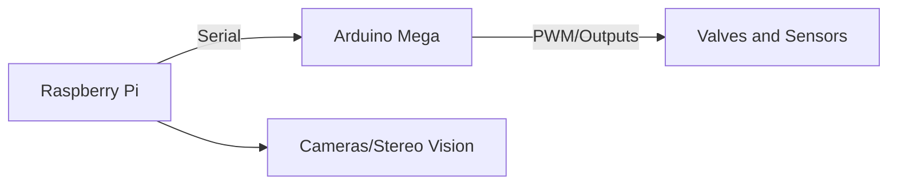

## 🧠 **Project Summary**

**Goal:** Build a robot inspired by Boston Dynamics' bio-robotics, with 4 legs, 2 arms, and visual sensors, for automated space exploration, anchoring on asteroids, remote construction of bases and ships, powered by solar energy.

---

## 🚧 Stage 1: **Development of the Terrestrial Robot (Prototype)**

### 📦 Base Structure

* **Type of robot:** Quadruped with two arms (similar to Boston Dynamics' *Spot*, but with arms and a head with "eyes").
* **Mobility:** 4 legs driven by **pneumatic actuators** — this requires solenoid valves controlled by an **Arduino Mega**, using compressors and tubing.
* **Arms:** Used for manipulation and assembly. Also use compressed air or servo motors.
* **Head:** Two "eyes" (cameras), for stereoscopic vision.

### 🧠 Control and Computing

* **Arduino Mega:** Directly controls motors and sensors (real-time), reads pressure, angle, and position sensors.
* **Raspberry Pi:** Acts as the robot's brain — image processing, navigation, network communication, execution of AI and decision algorithms.
* Communication between them: via **serial port** (UART or USB).

---

## 🧪 Stage 2: **Purchase and Modification of a Commercial Robot**

> “I will buy the robot dog from Boston Dynamics, it costs 400 euros”

Note: a real *Spot Mini* from Boston Dynamics costs much more (around €75,000). This may refer to a **Chinese replica**, which mimics quadruped movement controlled via app or Arduino. These are good bases for adding arms and vision.

* Add:

  * **Arms with servo motors or pneumatic pistons**
  * **Top platform** for Raspberry Pi + batteries + sensors
  * **Vision**: 2 USB cameras or PiCam

---

## 🚀 Stage 3: **Simulated / Future Space Mission**

### 🌌 Robot in Space

* A robot with legs allows **anchoring on asteroids** with near-zero gravity.
* Legs can push, grab, and fix the robot to rocks (better than wheels, which would float).
* Arms build the **robotic base** and the **factory-ship**.

### 🔧 Mission Steps:

1. **Robot is launched into space** with other components.
2. **Controlled remotely from Earth**, begins to assemble the base.
3. **Uses secondary robots** (smaller) to assist — robots building robots.
4. Once the base is ready, robots will:

   * **Capture small asteroids** with nets, arms, or propulsion.
   * **Extract water, metals, and minerals** using tools and thermal cameras.

---

## 🔋 Energy and Climate

### ☀️ Solar Power

* Solar panels recharge the robot’s (Li-Ion) batteries.
* The Raspberry Pi can monitor energy and adjust tasks.
* The Arduino can manage actuator energy consumption.

### 🌑 Cooling via Shade

* In space, there is extreme heat and total cold.
* Use **natural shadow zones** (or create shadows with robotic awnings) to **cool components**.
* Radiators and reflectors may be used to dissipate heat.

---

## 💻 Programming and Updates

> “Everything can be reprogrammed remotely”

* **SSH over radio or satellite network** to access the Raspberry Pi remotely.
* Python or C++ code updates can be sent to change behavior.
* **Arduino Mega** can receive updates via serial interface programmed by the Pi.

---

## 🧩 Modules to Develop

1. **Automatic locomotion**: walking calculation based on sensors and pressure.
2. **Balance**: using IMU sensors and foot feedback.
3. **Stereoscopic vision**: object distance for navigation and manipulation.
4. **Remote task planning**: Python scripts in stages to build structures.
5. **Energy management**: monitor batteries and switch between panels and load.
6. **Transmission and reception**: communication with Earth.

---

## 📅 Timeline

| Month            | Task                                                    |
| ---------------- | ------------------------------------------------------- |
| July–September   | Construction of the terrestrial prototype               |
| October–December | Integration of remote control and vision                |
| January          | Friend on vacation helps with assembling the real robot |
| February–June    | Tests, mission simulation, planning space deployment    |

---

## 🛠️ Suggested Components

* Arduino Mega 2560
* Raspberry Pi 5
* 12V solenoid valves
* Relay or MOSFET modules
* USB cameras or PiCam
* IMU sensors (MPU6050)
* 12V Li-Po battery
* Small solar panels for testing
* Arms with pneumatic pistons or servo motors

---

**To do:**

* Electronic schematics
* Code for walking with pneumatic legs
* Graphical interface for remote control
* 3D simulator of the robot ship in space
