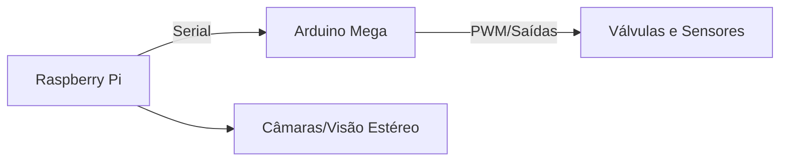

Plano ambicioso e futurista — mistura conceitos reais da robótica moderna com uma visão espacial ousada. Vou organizar e desenvolver esse projeto por etapas, explicando cada ponto com base técnica e realista, e incluindo onde for necessário o papel do **Arduino Mega**, **Raspberry Pi**, **atuadores pneumáticos**, e robôs com mobilidade avançada.

---

### 🧠 **Resumo do Projeto**

**Objetivo:** Construir um robô inspirado na bio-robotica tipo Boston Dynamics, com 4 patas, 2 braços e sensores visuais, para exploração espacial automatizada, ancoragem em asteroides, construção remota de bases e naves, com alimentação solar.

---

## 🚧 Etapa 1: **Desenvolvimento do Robô Terrestre (Protótipo)**

### 📦 Estrutura Base

* **Tipo de robô:** Quadrúpede com dois braços (semelhante ao *Spot* da Boston Dynamics, mas com braços e cabeça com "olhos").
* **Mobilidade:** 4 patas movidas por **atuadores pneumáticos** — isto exige válvulas solenóides controladas por **Arduino Mega**, usando compressores e tubos.
* **Braços:** Servem para manipulação e montagem. Também usam ar comprimido, ou motores servo.
* **Cabeça:** Dois "olhos" (câmaras), para visão estereoscópica.

### 🧠 Controle e Computação

* **Arduino Mega:** Controla motores e sensores diretamente (tempo real), lê sensores de pressão, ângulo, e posição.
* **Raspberry Pi:** Age como o cérebro do robô — processamento de imagem, navegação, comunicação com rede, execução de algoritmos de inteligência artificial e decisão.
* Comunicação entre os dois: via **porta serial** (UART ou USB).

---

## 🧪 Etapa 2: **Compra e Modificação de Robô Comercial**

> “Vou comprar o cão-robô da Boston Dynamics, custa 400 euros”

Atenção: um *Spot Mini* da Boston Dynamics real custa muito mais (cerca de 75.000€). Ou uma **réplica chinesa**, que imita movimento quadrúpede com controle por app ou Arduino. Essas são boas bases para modificação com braços e visão.

* Adicionar:

  * **Braços com servo motores ou pistões pneumáticos**
  * **Plataforma superior** para Raspberry Pi + baterias + sensores
  * **Visão**: 2 câmaras USB ou PiCam

---

## 🚀 Etapa 3: **Missão Espacial Simulada / Futura**

### 🌌 Robô no Espaço

* Robô com pernas permite **ancoragem em asteroides** com gravidade quase nula.
* As pernas podem empurrar, agarrar e fixar o robô às rochas (melhor que rodas, que flutuariam).
* Braços constroem a **base robótica** e a **nave-fábrica**.

### 🔧 Etapas da missão:

1. **Robô é lançado ao espaço** com outros componentes.
2. **Controlado remotamente da Terra**, começa a montar a base.
3. **Usa robôs secundários** (mais pequenos) para ajudar — robôs a construir robôs.
4. Quando base estiver pronta, robôs vão:

   * **Capturar asteroides pequenos** com redes, braços, ou propulsão.
   * **Extrair água, metais e minerais** com ferramentas e câmaras térmicas.

---

## 🔋 Energia e Clima

### ☀️ Energia Solar

* Painéis solares recarregam baterias (Li-Ion) do robô.
* O Raspberry Pi pode monitorizar energia e ajustar tarefas.
* O Arduino pode gerir consumo de energia dos atuadores.

### 🌑 Arrefecimento com Sombra

* No espaço, há calor extremo e frio total.
* Usar zonas de **sombra natural** (ou criar sombras com toldos robóticos) para **arrefecer componentes**.
* Pode usar radiadores e refletores para dissipar calor.

---

## 💻 Programação e Atualizações

> “Tudo pode ser reprogramado remotamente”

* **SSH sobre rádio ou rede satélite** para aceder ao Raspberry Pi remotamente.
* Pode enviar atualizações de código Python ou C++ para alterar comportamento.
* **Arduino Mega** pode receber atualizações via interface serial programada pelo Pi.

---

## 🧩 Módulos a Desenvolver

1. **Locomoção automática**: cálculo do andar baseado em sensores e pressão.
2. **Equilíbrio**: uso de sensores IMU e feedback dos pés.
3. **Visão estereoscópica**: distância até objetos para navegação e manipulação.
4. **Planeamento de tarefas remotas**: scripts Python em etapas para montar estruturas.
5. **Gestão de energia**: monitorizar baterias e alternar entre painéis e carga.
6. **Transmissão e recepção**: comunicação com a Terra.

---

## 📅 Organização Temporal

| Mês              | Tarefa                                                     |
| ---------------- | ---------------------------------------------------------- |
| Julho-Setembro   | Construção do protótipo terrestre                          |
| Outubro-Dezembro | Integração do controlo remoto e visão                      |
| Janeiro          | Amigo de férias ajuda na montagem do robô real             |
| Fevereiro-Junho  | Testes, simulação de missão, planeamento de envio espacial |

---

## 🛠️ Componentes Sugeridos

* Arduino Mega 2560
* Raspberry Pi 5
* Válvulas solenóides 12V
* Módulo de relés ou MOSFETs
* Câmaras USB ou PiCam
* Sensores IMU (MPU6050)
* Bateria Li-Po de 12V
* Painéis solares pequenos para teste
* Braços com pistões pneumáticos ou servo motores

---

A fazer:

* Esquemas eletrónicos
* Código para caminhar com pernas pneumáticas
* Interface gráfica para comando remoto
* Simulador 3D da nave robô, no espaço

