Plano ambicioso e futurista — mistura conceitos reais da robótica moderna com uma visão espacial ousada. Vou organizar e desenvolver esse projeto por etapas, explicando cada ponto com base técnica e realista, e incluindo onde for necessário o papel do **Arduino Mega**, **Raspberry Pi**, **atuadores pneumáticos**, e robôs com mobilidade avançada.

---

### 🧠 **Resumo do Projeto**

**Objetivo:** Construir um robô inspirado na bio-robotica tipo Boston Dynamics, com 4 patas, 2 braços e sensores visuais, para exploração espacial automatizada, ancoragem em asteroides, construção remota de bases e naves, com alimentação solar.

---

## 🚧 Etapa 1: **Desenvolvimento do Robô Terrestre (Protótipo)**

### 📦 Estrutura Base

* **Tipo de robô:** Quadrúpede com dois braços (semelhante ao *Spot* da Boston Dynamics, mas com braços e cabeça com "olhos").
* **Mobilidade:** 4 patas movidas por **atuadores pneumáticos** — isto exige válvulas solenóides controladas por **Arduino Mega**, usando compressores e tubos.
* **Braços:** Servem para manipulação e montagem. Também usam ar comprimido, ou motores servo.
* **Cabeça:** Dois "olhos" (câmaras), para visão estereoscópica.

### 🧠 Controle e Computação

* **Arduino Mega:** Controla motores e sensores diretamente (tempo real), lê sensores de pressão, ângulo, e posição.
* **Raspberry Pi:** Age como o cérebro do robô — processamento de imagem, navegação, comunicação com rede, execução de algoritmos de inteligência artificial e decisão.
* Comunicação entre os dois: via **porta serial** (UART ou USB).

```mermaid
graph LR
A[Raspberry Pi] -->|Serial| B[Arduino Mega]
B -->|PWM/Saídas| C[Válvulas e Sensores]
A --> D[Câmaras/Visão Estéreo]
```



---

## 🧪 Etapa 2: **Compra e Modificação de Robô Comercial**

> “Vou comprar o cão-robô da Boston Dynamics, custa 400 euros”

Atenção: um *Spot Mini* da Boston Dynamics real custa muito mais (cerca de 75.000€). Ou uma **réplica chinesa**, que imita movimento quadrúpede com controle por app ou Arduino. Essas são boas bases para modificação com braços e visão.

* Adicionar:

  * **Braços com servo motores ou pistões pneumáticos**
  * **Plataforma superior** para Raspberry Pi + baterias + sensores
  * **Visão**: 2 câmaras USB ou PiCam

---

## 🚀 Etapa 3: **Missão Espacial Simulada / Futura**

### 🌌 Robô no Espaço

* Robô com pernas permite **ancoragem em asteroides** com gravidade quase nula.
* As pernas podem empurrar, agarrar e fixar o robô às rochas (melhor que rodas, que flutuariam).
* Braços constroem a **base robótica** e a **nave-fábrica**.

### 🔧 Etapas da missão:

1. **Robô é lançado ao espaço** com outros componentes.
2. **Controlado remotamente da Terra**, começa a montar a base.
3. **Usa robôs secundários** (mais pequenos) para ajudar — robôs a construir robôs.
4. Quando base estiver pronta, robôs vão:

   * **Capturar asteroides pequenos** com redes, braços, ou propulsão.
   * **Extrair água, metais e minerais** com ferramentas e câmaras térmicas.

---

## 🔋 Energia e Clima

### ☀️ Energia Solar

* Painéis solares recarregam baterias (Li-Ion) do robô.
* O Raspberry Pi pode monitorizar energia e ajustar tarefas.
* O Arduino pode gerir consumo de energia dos atuadores.

### 🌑 Arrefecimento com Sombra

* No espaço, há calor extremo e frio total.
* Usar zonas de **sombra natural** (ou criar sombras com toldos robóticos) para **arrefecer componentes**.
* Pode usar radiadores e refletores para dissipar calor.

---

## 💻 Programação e Atualizações

> “Tudo pode ser reprogramado remotamente”

* **SSH sobre rádio ou rede satélite** para aceder ao Raspberry Pi remotamente.
* Pode enviar atualizações de código Python ou C++ para alterar comportamento.
* **Arduino Mega** pode receber atualizações via interface serial programada pelo Pi.

---

## 🧩 Módulos a Desenvolver

1. **Locomoção automática**: cálculo do andar baseado em sensores e pressão.
2. **Equilíbrio**: uso de sensores IMU e feedback dos pés.
3. **Visão estereoscópica**: distância até objetos para navegação e manipulação.
4. **Planeamento de tarefas remotas**: scripts Python em etapas para montar estruturas.
5. **Gestão de energia**: monitorizar baterias e alternar entre painéis e carga.
6. **Transmissão e recepção**: comunicação com a Terra.

---

## 📅 Organização Temporal

| Mês              | Tarefa                                                     |
| ---------------- | ---------------------------------------------------------- |
| Julho-Setembro   | Construção do protótipo terrestre                          |
| Outubro-Dezembro | Integração do controlo remoto e visão                      |
| Janeiro          | Amigo de férias ajuda na montagem do robô real             |
| Fevereiro-Junho  | Testes, simulação de missão, planeamento de envio espacial |

---

## 🛠️ Componentes Sugeridos

* Arduino Mega 2560
* Raspberry Pi 5
* Válvulas solenóides 12V
* Módulo de relés ou MOSFETs
* Câmaras USB ou PiCam
* Sensores IMU (MPU6050)
* Bateria Li-Po de 12V
* Painéis solares pequenos para teste
* Braços com pistões pneumáticos ou servo motores

---

A fazer:

* Esquemas eletrónicos
* Código para caminhar com pernas pneumáticas
* Interface gráfica para comando remoto
* Simulador 3D da nave robô, no espaço
---
# PROJETO A
Vamos desenvolver um sistema completo que permite:

* Controlar remotamente dois Arduinos (A e B) ligados a um Raspberry Pi.
* Usar uma interface gráfica (GUI) em Python com Qt (PyQt5 ou PySide6).
* Permitir executar o cliente Qt em Windows 10, Ubuntu e macOS.
* Comunicar entre a GUI e o Raspberry Pi por SSH e depois via porta série com os Arduinos.

---

## 🔧 Arquitetura

```
[PC com GUI Qt] ─── SSH  ───> [Raspberry Pi]
                                   │
               ┌───────────────────┴──────────────────┐
               │                                      │
         [Arduino A via USB]                  [Arduino B via USB]
```

---

## 1. Script Python com GUI Qt (PC cliente)

### Requisitos:

```bash
pip install PyQt5 paramiko
```

### Código `cliente_gui.py`

```python
import sys
import paramiko
from PyQt5.QtWidgets import QApplication, QWidget, QVBoxLayout, QPushButton, QLabel, QComboBox, QMenuBar, QFileDialog, QMessageBox

class JanelaPrincipal(QWidget):
    def __init__(self):
        super().__init__()
        self.setWindowTitle("Controlo Remoto dos Arduinos")
        self.resize(400, 300)
        
        self.usuario = "pi"
        self.host = "192.168.1.100"  # IP do Raspberry Pi
        self.porta = 22
        self.palavra_passe = "raspberry"
        
        self.init_ui()
    
    def init_ui(self):
        layout = QVBoxLayout()

        menu_bar = QMenuBar(self)
        menu_arquivo = menu_bar.addMenu("Ficheiro")
        menu_arquivo.addAction("Sair", self.close)
        layout.setMenuBar(menu_bar)

        self.combo_arduino = QComboBox()
        self.combo_arduino.addItems(["Arduino A", "Arduino B"])
        layout.addWidget(self.combo_arduino)

        self.label_estado = QLabel("Desligado")
        layout.addWidget(self.label_estado)

        botao_ligar = QPushButton("Ligar")
        botao_ligar.clicked.connect(self.ligar_arduino)
        layout.addWidget(botao_ligar)

        botao_desligar = QPushButton("Desligar")
        botao_desligar.clicked.connect(self.desligar_arduino)
        layout.addWidget(botao_desligar)

        self.setLayout(layout)

    def executar_comando_remoto(self, comando):
        try:
            cliente = paramiko.SSHClient()
            cliente.set_missing_host_key_policy(paramiko.AutoAddPolicy())
            cliente.connect(hostname=self.host, username=self.usuario, password=self.palavra_passe, port=self.porta)

            stdin, stdout, stderr = cliente.exec_command(comando)
            saida = stdout.read().decode().strip()
            cliente.close()
            return saida
        except Exception as e:
            QMessageBox.critical(self, "Erro", f"Erro na ligação SSH: {e}")
            return None

    def ligar_arduino(self):
        arduino = self.combo_arduino.currentText()
        comando = f"python3 ligar_{arduino.lower().replace(' ', '_')}.py"
        resultado = self.executar_comando_remoto(comando)
        if resultado:
            self.label_estado.setText(f"{arduino} ligado")

    def desligar_arduino(self):
        arduino = self.combo_arduino.currentText()
        comando = f"python3 desligar_{arduino.lower().replace(' ', '_')}.py"
        resultado = self.executar_comando_remoto(comando)
        if resultado:
            self.label_estado.setText(f"{arduino} desligado")

if __name__ == "__main__":
    app = QApplication(sys.argv)
    janela = JanelaPrincipal()
    janela.show()
    sys.exit(app.exec_())
```

---

## 2. Scripts Python no Raspberry Pi

### Instalar dependências

```bash
sudo apt update
sudo apt install python3-serial
```

### `ligar_arduino_a.py`

```python
import serial
arduino = serial.Serial('/dev/ttyUSB0', 9600)
arduino.write(b'LIGAR\n')
```

### `desligar_arduino_a.py`

```python
import serial
arduino = serial.Serial('/dev/ttyUSB0', 9600)
arduino.write(b'DESLIGAR\n')
```

### `ligar_arduino_b.py`

```python
import serial
arduino = serial.Serial('/dev/ttyUSB1', 9600)
arduino.write(b'LIGAR\n')
```

### `desligar_arduino_b.py`

```python
import serial
arduino = serial.Serial('/dev/ttyUSB1', 9600)
arduino.write(b'DESLIGAR\n')
```

---

## 3. Scripts Arduino (para ambos)

### Código `arduino_a.ino` (e igual para `arduino_b.ino` com ajustes nos pinos)

```cpp
void setup() {
  Serial.begin(9600);
  pinMode(13, OUTPUT); // LED ou motor
}

void loop() {
  if (Serial.available()) {
    String comando = Serial.readStringUntil('\n');
    comando.trim();

    if (comando == "LIGAR") {
      digitalWrite(13, HIGH);
    } else if (comando == "DESLIGAR") {
      digitalWrite(13, LOW);
    }
  }
}
```

---

## 🧪 Testar em:

### 🪟 Windows 10 / 🐧 Ubuntu / 🍎 Mac:

1. Instala Python 3 e `PyQt5` + `paramiko`:

   ```bash
   pip install pyqt5 paramiko
   ```

2. Corre o script:

   ```bash
   python cliente_gui.py
   ```

---

## ✅ O que está incluído

* Interface Qt com botões e menu.
* SSH automático para Raspberry Pi.
* Controlo individual dos Arduinos A e B.
* Comunicação série com comandos simples "LIGAR" e "DESLIGAR".
* Compatibilidade multiplataforma.
---

